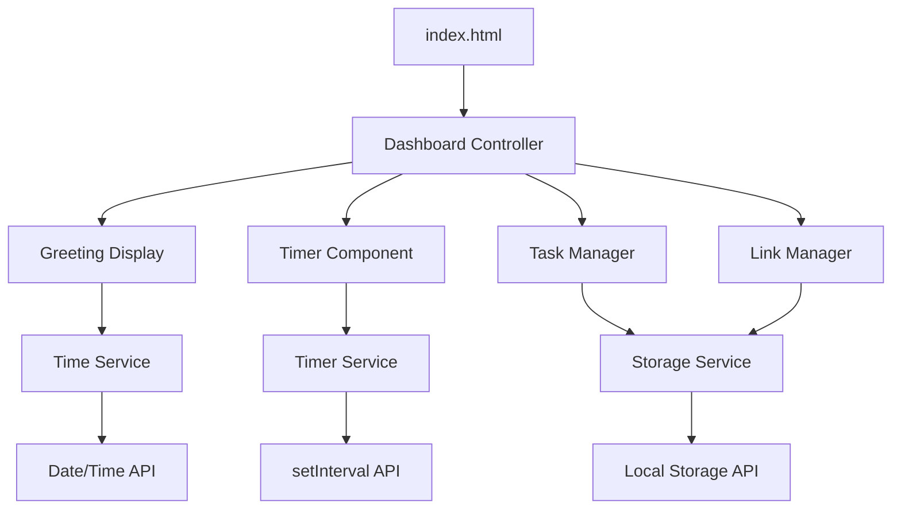

# Design Document: Productivity Dashboard

## Overview

The Productivity Dashboard is a client-side web application that combines essential productivity tools into a single, clean interface. The system provides time management through a focus timer, task tracking via a to-do list, and quick access to favorite websites through saved links. All functionality is implemented using vanilla JavaScript with browser Local Storage for data persistence.

### Key Design Principles

- **Simplicity**: Clean, minimal interface that reduces cognitive load
- **Performance**: Fast loading and responsive interactions under 100ms
- **Privacy**: All data stored locally in the browser, no external services
- **Compatibility**: Works across modern browsers without external dependencies
- **Maintainability**: Clear separation of concerns with semantic HTML, modular CSS, and organized JavaScript

## Architecture

The application follows a component-based architecture implemented in vanilla JavaScript, with each major feature encapsulated as a separate module.



### Architecture Layers

1. **Presentation Layer**: HTML structure and CSS styling
2. **Component Layer**: Individual feature modules (Timer, Tasks, Links, Greeting)
3. **Service Layer**: Shared utilities (Storage, Time, Timer services)
4. **Browser API Layer**: Local Storage, Date/Time, DOM APIs

## Components and Interfaces

### Dashboard Controller

Central coordinator that initializes and manages all components.

```javascript
class DashboardController {
  constructor()
  init()
  bindEvents()
}
```

**Responsibilities:**
- Initialize all components on page load
- Coordinate inter-component communication
- Handle global error states

### Greeting Display Component

Manages time-based greeting and current date/time display.

```javascript
class GreetingDisplay {
  constructor(element)
  updateDisplay()
  getTimeBasedGreeting()
  formatTime(date)
  formatDate(date)
}
```

**Interface:**
- Updates every minute via setInterval
- Displays greeting based on current hour
- Shows time in HH:MM format
- Shows date in readable format

### Timer Component

Implements 25-minute Pomodoro-style focus timer.

```javascript
class TimerComponent {
  constructor(element)
  start()
  stop()
  reset()
  updateDisplay()
  onComplete()
}
```

**Interface:**
- 25-minute countdown timer
- Start/Stop/Reset controls
- MM:SS display format
- Completion notification

**State Management:**
- `isRunning`: boolean
- `timeRemaining`: seconds (0-1500)
- `intervalId`: timer reference

### Task Manager Component

Handles CRUD operations for task management with Local Storage persistence.

```javascript
class TaskManager {
  constructor(element, storageService)
  addTask(description)
  editTask(id, newDescription)
  toggleTask(id)
  deleteTask(id)
  renderTasks()
  loadTasks()
}
```

**Interface:**
- Add new tasks with text input
- Edit existing task descriptions inline
- Toggle completion status
- Delete tasks with confirmation
- Persist all changes to Local Storage

### Link Manager Component

Manages favorite website links with Local Storage persistence.

```javascript
class LinkManager {
  constructor(element, storageService)
  addLink(url, label)
  editLink(id, url, label)
  deleteLink(id)
  openLink(url)
  renderLinks()
  loadLinks()
}
```

**Interface:**
- Add links with URL and custom label
- Edit existing links
- Delete links with confirmation
- Open links in new tabs
- Persist all changes to Local Storage

### Storage Service

Centralized Local Storage management with error handling.

```javascript
class StorageService {
  static save(key, data)
  static load(key)
  static remove(key)
  static isSupported()
}
```

**Interface:**
- JSON serialization/deserialization
- Error handling for storage failures
- Browser compatibility checks

## Data Models

### Task Model

```javascript
{
  id: string,           // UUID or timestamp-based
  description: string,  // Task text
  completed: boolean,   // Completion status
  createdAt: Date,     // Creation timestamp
  updatedAt: Date      // Last modification timestamp
}
```

### Link Model

```javascript
{
  id: string,     // UUID or timestamp-based
  url: string,    // Website URL (validated)
  label: string,  // Display name
  createdAt: Date // Creation timestamp
}
```

### Timer State

```javascript
{
  timeRemaining: number, // Seconds (0-1500)
  isRunning: boolean,    // Timer active state
  startTime: Date        // When timer was started
}
```

### Storage Keys

- `productivity-dashboard-tasks`: Array of Task objects
- `productivity-dashboard-links`: Array of Link objects
- `productivity-dashboard-timer`: Timer state object

## User Interface Layout

### Overall Layout Structure

```
┌─────────────────────────────────────┐
│           Header Section            │
│    [Greeting] [Time] [Date]        │
├─────────────────────────────────────┤
│           Timer Section             │
│      [25:00] [Start][Stop][Reset]   │
├─────────────────────────────────────┤
│           Tasks Section             │
│  [Add Task Input] [Add Button]     │
│  □ Task 1              [Edit][Del]  │
│  ☑ Task 2 (completed)  [Edit][Del]  │
├─────────────────────────────────────┤
│          Quick Links Section        │
│  [Add Link Form]                   │
│  [Link 1] [Link 2] [Link 3]        │
│  [Edit] [Delete] controls          │
└─────────────────────────────────────┘
```

### CSS Grid Layout

```css
.dashboard {
  display: grid;
  grid-template-rows: auto auto 1fr auto;
  grid-template-areas: 
    "greeting"
    "timer"
    "tasks"
    "links";
  gap: 2rem;
  max-width: 800px;
  margin: 0 auto;
  padding: 2rem;
}
```

### Responsive Design

- Mobile-first approach with min-width media queries
- Flexible grid layout that adapts to screen size
- Touch-friendly button sizes (minimum 44px)
- Readable typography scaling

## Implementation Approach

### File Structure

```
productivity-dashboard/
├── index.html
├── css/
│   └── styles.css
└── js/
    └── app.js
```

### Development Phases

1. **Phase 1**: HTML structure and basic CSS styling
2. **Phase 2**: Greeting display and time updates
3. **Phase 3**: Timer component with controls
4. **Phase 4**: Task management with Local Storage
5. **Phase 5**: Link management with Local Storage
6. **Phase 6**: Cross-browser testing and optimization

### JavaScript Module Pattern

Using IIFE (Immediately Invoked Function Expression) to create modules:

```javascript
const ProductivityDashboard = (function() {
  'use strict';
  
  // Private variables and functions
  let components = {};
  
  // Public API
  return {
    init: function() {
      // Initialize all components
    }
  };
})();

// Initialize on DOM ready
document.addEventListener('DOMContentLoaded', ProductivityDashboard.init);
```

### Error Handling Strategy

- Graceful degradation for unsupported browsers
- Local Storage availability checks
- User-friendly error messages
- Fallback behaviors for failed operations
- Console logging for debugging

### Performance Optimizations

- Minimal DOM queries with element caching
- Efficient event delegation
- Debounced input handlers
- Lazy loading of non-critical features
- CSS animations over JavaScript animations

## Correctness Properties

*A property is a characteristic or behavior that should hold true across all valid executions of a system-essentially, a formal statement about what the system should do. Properties serve as the bridge between human-readable specifications and machine-verifiable correctness guarantees.*

### Property 1: Time and Date Formatting

*For any* valid Date object, the formatting functions should produce consistent, readable output where time is in HH:MM format and dates are in human-readable format.

**Validates: Requirements 1.1, 1.2, 3.6**

### Property 2: Time-Based Greeting Logic

*For any* hour of the day (0-23), the greeting function should return the correct greeting: "Good Morning" for 5-11, "Good Afternoon" for 12-16, "Good Evening" for 17-20, and "Good Night" for 21-4.

**Validates: Requirements 2.1, 2.2, 2.3, 2.4**

### Property 3: Timer State Management

*For any* timer state, the start/stop/reset operations should correctly transition the timer between running and stopped states, with reset always returning to 1500 seconds (25:00).

**Validates: Requirements 3.2, 3.3, 3.4**

### Property 4: Task Persistence Round-Trip

*For any* valid task object, adding it to the task manager and then reloading from storage should preserve all task properties (id, description, completed status, timestamps).

**Validates: Requirements 4.1, 4.2, 5.1, 5.2, 5.3, 5.4, 5.5**

### Property 5: Task Completion Status

*For any* task in the task manager, toggling its completion status should immediately update both the visual display and the stored data to reflect the new state.

**Validates: Requirements 4.3, 5.3**

### Property 6: Task Deletion Consistency

*For any* task in the task manager, deleting it should remove it from both the displayed list and the stored data, with no references remaining.

**Validates: Requirements 4.4, 5.4**

### Property 7: Link Persistence Round-Trip

*For any* valid link object with URL and label, adding it to the link manager and then reloading from storage should preserve all link properties (id, url, label, timestamp).

**Validates: Requirements 6.1, 6.4, 7.1, 7.2, 7.3, 7.4**

### Property 8: Link Display Consistency

*For any* saved link, it should be displayed as a clickable element with the correct label and URL accessible for interaction.

**Validates: Requirements 6.2**

### Property 9: Link Deletion Consistency

*For any* link in the link manager, deleting it should remove it from both the displayed list and the stored data, with no references remaining.

**Validates: Requirements 6.5, 7.3**

## Error Handling

### Storage Error Handling

The application must gracefully handle Local Storage failures:

- **Storage Unavailable**: Display user-friendly error message when Local Storage is not supported
- **Storage Full**: Provide feedback when storage quota is exceeded
- **Data Corruption**: Validate stored data and reset to defaults if corrupted
- **Concurrent Access**: Handle potential race conditions in storage operations

### Timer Error Handling

- **Invalid State**: Prevent timer operations when in invalid states
- **Precision Loss**: Handle floating-point precision issues in countdown calculations
- **Browser Tab Inactive**: Maintain accurate timing when tab is not visible

### Input Validation

- **Task Descriptions**: Validate non-empty strings, handle special characters
- **Link URLs**: Validate URL format, handle malformed URLs gracefully
- **Link Labels**: Validate non-empty strings, handle length limits

### Browser Compatibility Fallbacks

- **Feature Detection**: Check for required APIs before using them
- **Polyfills**: Provide fallbacks for missing functionality where possible
- **Graceful Degradation**: Maintain core functionality even when advanced features fail

## Testing Strategy

### Dual Testing Approach

The testing strategy combines unit tests for specific scenarios with property-based tests for comprehensive coverage:

**Unit Tests** focus on:
- Specific examples and edge cases (empty inputs, boundary conditions)
- Integration points between components
- Error conditions and fallback behaviors
- Browser compatibility scenarios

**Property-Based Tests** focus on:
- Universal properties that hold across all valid inputs
- Comprehensive input coverage through randomization
- Correctness guarantees for core functionality

### Property-Based Testing Implementation

Using **fast-check** library for JavaScript property-based testing:

- **Minimum 100 iterations** per property test to ensure thorough coverage
- Each property test references its corresponding design document property
- Tag format: **Feature: productivity-dashboard, Property {number}: {property_text}**

### Test Configuration

```javascript
// Example property test structure
fc.test('Feature: productivity-dashboard, Property 1: Time and Date Formatting', 
  fc.property(fc.date(), (date) => {
    const timeStr = formatTime(date);
    const dateStr = formatDate(date);
    
    // Verify HH:MM format
    expect(timeStr).toMatch(/^\d{2}:\d{2}$/);
    // Verify readable date format
    expect(dateStr).toBeTruthy();
    expect(typeof dateStr).toBe('string');
  }), 
  { numRuns: 100 }
);
```

### Unit Test Coverage

- **Greeting Display**: Time formatting, date formatting, greeting logic
- **Timer Component**: Start/stop/reset operations, display formatting, completion handling
- **Task Manager**: CRUD operations, persistence, data validation
- **Link Manager**: CRUD operations, persistence, URL validation
- **Storage Service**: Save/load operations, error handling, browser compatibility

### Integration Testing

- **Component Initialization**: Verify all components initialize correctly on page load
- **Cross-Component Communication**: Test interactions between components
- **Storage Integration**: Verify data persistence across browser sessions
- **Error Recovery**: Test graceful handling of various failure scenarios

### Performance Testing

- **Load Time**: Verify dashboard loads within 2 seconds
- **Response Time**: Verify interactions respond within 100ms
- **Memory Usage**: Monitor for memory leaks in long-running sessions
- **Storage Efficiency**: Verify efficient use of Local Storage space

### Browser Compatibility Testing

Manual testing across target browsers:
- Chrome 80+, Firefox 75+, Edge 80+, Safari 13+
- Local Storage functionality verification
- JavaScript feature compatibility
- CSS rendering consistency